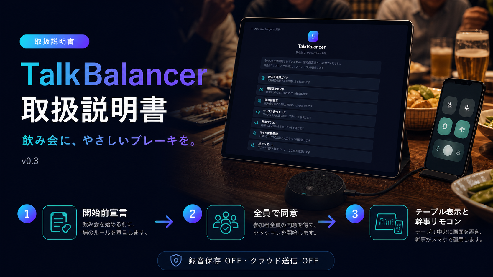

# Attention Ledger

**Measure the cognitive load of any UI — automatically, using AI agents.**

Attention Ledger sends a simulated first-time user (an LLM agent) to complete tasks on a web interface. The number of tokens the agent consumes while navigating and reasoning is used as a proxy for **cognitive complexity**: a confusing UI costs more tokens than a clear one. Compare two versions of the same screen and you get an objective, reproducible usability delta.

このリポジトリには、飲み会の会話バランスを整えるサブプロジェクト **[TalkBalancer](docs/talkbalancer/README.md)** も含まれています。

---

## Live Demo (GitHub Pages)

UI は GitHub Pages で公開されています（main ブランチへの push で自動デプロイ）:

**<https://taguchi-1989.github.io/Atention_token/>**

GitHub Pages 版にはバックエンド（FastAPI）が無いため、Attention Ledger のダッシュボードは接続エラー表示になりますが、**TalkBalancer はデモモードで完全に動作します**（データは localStorage のみ・音声は端末外に出ません）。テーブル表示と幹事リモコンを同じブラウザの別タブで開くと連携を体験できます。フル機能はローカル実行（下記 Quick Start）で利用してください。

---

## TalkBalancer v0.3

飲み会や懇親会で、幹事が言いにくい注意を匿名の丁寧な通知で代行し、発話バランスや店内音量を見える化する進行支援アプリです。外部マイクがなくてもPC・携帯の内蔵マイク簡易モードで開始でき、相対音量を数値表示します。AndroidではPWAとしてホーム画面へ追加でき、[携帯1台モード](src/app/talkbalancer/mobile/page.tsx)でテーブル表示・マイク計測・幹事操作を同じ画面から利用できます。表示専用モードでは全画面化し、ヘッダーと操作ボタンを自動で隠して画面占有を抑えます。録音保存とクラウド送信は初期設定で OFF、セッション終了時に通知・発話・メモ・騒音データを削除できます。

[8枚組の販促・取扱説明資料を見る](public/manual/talkbalancer-v0.3/README.md)



---

## Why it works

| Signal                 | Interpretation                                             |
| ---------------------- | ---------------------------------------------------------- |
| High token consumption | Agent struggled — many re-reads, ambiguous affordances     |
| Low token consumption  | Agent succeeded quickly — clear labels, logical flow       |
| Step count             | How many interactions were needed                          |
| Failure reason         | What specifically confused the agent                       |

---

## Architecture

```text
┌─────────────────────────────────────────┐
│              Browser / Tester           │
└───────────────┬────────────────────────┘
                │  HTTP (port 3000)
┌───────────────▼────────────────────────┐
│         Next.js Frontend (src/)        │
│  Dashboard · Task Runner · SUS Form    │
└───────────────┬────────────────────────┘
                │  HTTP (port 8000)
┌───────────────▼────────────────────────┐
│       FastAPI Backend (python/)        │
│  /tasks  /runs  /sus  /health          │
└───────┬──────────────────┬─────────────┘
        │                  │
┌───────▼──────┐   ┌───────▼──────────────┐
│  SQLite DB   │   │   Ollama / Mock LLM   │
│  ledger.db   │   │  (port 11434)         │
└──────────────┘   └──────────────────────┘
```

---

## Quick Start (Docker)

Prerequisites: [Docker Desktop](https://www.docker.com/products/docker-desktop/) installed and running.

```bash
# 1. Clone
git clone https://github.com/your-org/attention-ledger.git
cd attention-ledger

# 2. Configure (optional — defaults work for local Ollama)
cp .env.example .env

# 3. Start everything
docker compose up --build

# 4. Open the dashboard (FastAPI serves the exported UI)
open http://localhost:8000
```

Port 8000が使用中の場合は、`APP_PORT=8010 docker compose up --build`（PowerShellでは
`$env:APP_PORT=8010; docker compose up --build`）で公開ポートを変更できます。

> The API base URL is <http://localhost:8000/api>
> Interactive API docs: <http://localhost:8000/docs>

To use a real LLM, install [Ollama](https://ollama.ai), pull a model, and set `OLLAMA_URL` in `.env`:

```bash
ollama pull llama3
```

---

## Manual Setup

### Python Backend

```bash
cd python
python -m venv .venv             # Windowsで複数Pythonがある場合: py -3.12 -m venv .venv
source .venv/bin/activate       # Windows: .venv\Scripts\activate
pip install -r requirements.lock

# Start the API server
uvicorn attention_ledger.api.main:app --port 8000 --reload
```

Environment variables (optional — all have defaults):

| Variable                        | Default                         | Description           |
| ------------------------------- | ------------------------------- | --------------------- |
| `OLLAMA_URL`                    | `http://localhost:11434`        | Ollama endpoint       |
| `OLLAMA_MODEL`                  | `llama3`                        | Model name            |
| `ATTENTION_LEDGER_DB_PATH`      | `python/ledger.db`              | SQLite path           |
| `ATTENTION_LEDGER_TASKS_DIR`    | `python/tasks`                  | Task YAML directory   |

### Next.js Frontend

```bash
# リポジトリ直下で実行（package.json はルートにあります）
npm ci
npm run dev       # http://localhost:3000
```

Set `NEXT_PUBLIC_API_BASE_URL=http://localhost:8000/api` in `.env.local` at the repository root when the API runs on a different origin.

---

## Running a Task

### Via the dashboard

1. Open <http://localhost:3000>
2. Click a task card
3. Toggle **Mock Mode** (no Ollama needed) or leave off for real LLM
4. Click **Run** and watch the live log

### Via the API

```bash
# List available tasks
curl http://localhost:8000/api/tasks

# Run a task in mock mode
curl -X POST http://localhost:8000/api/tasks/EXPENSE_INPUT_V1/run \
  -H "Content-Type: application/json" \
  -d '{"baseline_id": "demo", "mock": true}'

# View run history
curl "http://localhost:8000/api/runs?limit=10&include_metrics=true"
```

---

## Demo A/B Scenarios

Three pairs of HTML pages are included in `python/tasks/` to demonstrate the measurement in action.

| Pair          | Bad (v1)                   | Good (v2)                  | Description                       |
| ------------- | -------------------------- | -------------------------- | --------------------------------- |
| Expense form  | `expense_v1.html`          | `expense_v2.html`          | Travel expense claim              |
| Shopping cart | `shopping_cart_v1.html`    | `shopping_cart_v2.html`    | EC product search + add to cart   |
| Inquiry form  | `inquiry_form_v1.html`     | `inquiry_form_v2.html`     | Customer support contact form     |

**Bad versions** feature: unclear labels, hidden fields, extra steps, distracting elements.

**Good versions** feature: clear labels, pre-filled defaults, minimal fields, obvious primary action.

Run the corresponding YAML task IDs (e.g., `EXPENSE_INPUT_V1` vs `EXPENSE_INPUT_V2`) and compare token counts.

---

## Running Tests

### Python

```bash
cd python
python -m pytest -k "not playwright" -m "not ollama"
```

Ollamaモデルのスモークテストは、Ollamaと対象モデルを起動したうえで
`python -m pytest -m ollama` を個別に実行します。

### Frontend

```bash
npm ci
npm test -- --runInBand
npm run lint
npm run build   # verify production build
```

---

## Screenshot Placeholders

```text
[ Dashboard screenshot ]          [ Task runner live log ]
```

---

## Project Structure

```text
attention-ledger/
├── Dockerfile                  # Next.js build + FastAPI runtime
├── docker-compose.yml          # Integrated app on port 8000
├── .env.example
├── .github/
│   └── workflows/
│       └── ci.yml              # Python pytest + Node jest/build
├── python/
│   ├── requirements.txt
│   ├── pytest.ini
│   ├── tasks/                  # YAML task definitions + HTML fixtures
│   │   ├── expense_v1.html / expense_v1.yaml
│   │   ├── expense_v2.html / expense_v2.yaml
│   │   ├── shopping_cart_v1.html / shopping_cart_v1.yaml
│   │   ├── shopping_cart_v2.html / shopping_cart_v2.yaml
│   │   ├── inquiry_form_v1.html / inquiry_form_v1.yaml
│   │   └── inquiry_form_v2.html / inquiry_form_v2.yaml
│   ├── tests/                  # pytest test suite
│   └── attention_ledger/
│       ├── api/main.py         # FastAPI application
│       ├── core/               # Agent, engine, task, ledger, metrics
│       └── cli/                # CLI entrypoint
└── src/                        # Next.js frontend
    ├── app/                    # App Router pages
    ├── components/
    ├── __tests__/
    └── package.json
```

---

## License

[Apache License 2.0](LICENSE)
