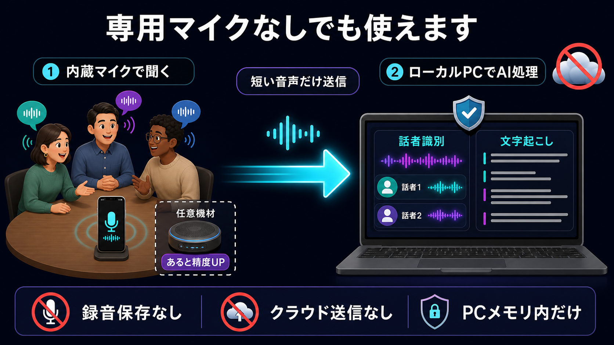
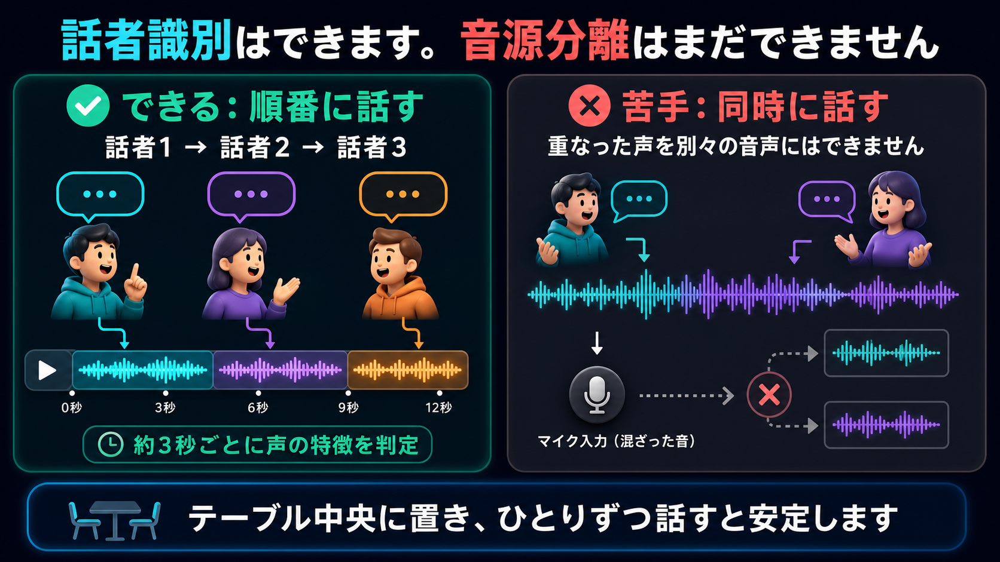

# TalkBalancer

飲み会・懇親会・社内交流会で、**話しすぎ・うるさすぎ・言いすぎ**を、場の空気を壊さず整えるアプリのドキュメント置き場。

> 飲み会に、やさしいブレーキを。

本リポジトリ（Attention Ledger）と同じく「人を評価せず、場の構造を整える」思想のプロダクトであり、技術スタック（Next.js + FastAPI + WebSocket + SQLite）も共通基盤を想定している。

## 今すぐ試す

- 公開PWA: <https://talkbalancer.pages.dev/talkbalancer>
- Android携帯1台モード: <https://talkbalancer.pages.dev/talkbalancer/mobile>
- ローカル統合版: <http://127.0.0.1:8010/talkbalancer>

公開PWAはバックエンド不要の端末内デモモードで動作し、ローカル文字起こし・自動話者切替は行わない。ローカルでAPI・WebSocketまで使う場合は、リポジトリ直下で `npm ci`、`npm run build` を実行後、`python` ディレクトリから次のコマンドで起動する。

```bash
python -m pip install -r requirements.lock
python -m pip install -r requirements-audio-ai.txt
python -m uvicorn attention_ledger.api.main:app --host 127.0.0.1 --port 8010
```

## ドキュメント

| ファイル | 内容 |
| --- | --- |
| [REQUIREMENTS_v0.2.md](./REQUIREMENTS_v0.2.md) | 要件定義書 v0.2（現行版）。携帯/iPad＋USB-Cマイクで配布、自宅PCで処理、将来ラズパイ化・EC2化の整合を取った版 |
| [TEST_PLAN.md](./TEST_PLAN.md) | v0.3 の自動テスト・2画面E2E・実機マイク・Docker検証手順 |
| [VERIFICATION_v0.3.md](./VERIFICATION_v0.3.md) | v0.3安定化時点の自動ゲート・2画面E2E・Docker実測結果 |

## 実装状況

**v0.4 ローカル音声AI版**。既存の Attention Ledger 基盤（FastAPI + Next.js 静的書き出し）に同居する形で動作する。

| 種別 | 場所 | 内容 |
| --- | --- | --- |
| API | `python/attention_ledger/api/talkbalancer.py` | セッション、話者対応、文字起こし状態、幹事アラート、騒音解析、終了前レポート（音声の録音/永続化なし） |
| ローカル音声AI | `python/attention_ledger/api/local_audio_ai.py` | faster-whisper文字起こし、pyannote音声埋め込みまたは簡易音響クラスタによるオンライン話者推定 |
| WebSocket | `/ws/metrics`・`/ws/transcription` | 音量値と、モードCで同意された16kHz PCM短時間バッファの受信 |
| 画面 | `src/app/talkbalancer/` | ホーム / 携帯1台モード（PWA） / 飲み会運用ガイド / 機器選定ガイド / 開始前宣言 / 同意確認 / テーブル表示 / 幹事リモコン / マイク接続確認 / 終了レポート |
| テスト | `python/tests/test_talkbalancer.py` | セッション・参加者登録・話者バランス・アラート・解析計算・WebSocket・自動アラート・終了前レポート |

利用フロー: `/talkbalancer` の最初の画面で「スマホ1台」または「PC・複数画面」のどちらかを選ぶ。以後は全画面共通の3ステップ表示に沿って、①開始前宣言と全員の合意、②解析モードとプライバシー同意、③マイク開始まで進む。スマホ1台を選んだ場合は同意後に `/talkbalancer/mobile` へ戻り、PC・複数画面を選んだ場合はマイク確認からテーブル表示へ進む。開催中のトップ画面は「この端末で進行」「テーブル画面」「幹事リモコン」の再開操作だけを強く表示し、機器ガイドやレポートは折りたたみに格納する。

初見利用者へ最初に見せる必須情報は、外付けマイク不要、モードCのみローカルPCが必要、録音保存・クラウド音声送信なし、の3点に限定する。参加者人数と名前は、発話バランスを使うモードB/Cを選択した場合だけ表示する。マイク接続確認（`/talkbalancer/mic`）は Web Audio API による入力レベル表示のみで録音しない。外部機材がない場合はPC内蔵マイク簡易モードへ進み、0〜100の相対音量とdBFS参考値を確認できる。

Android携帯1台で使う場合は `/talkbalancer/mobile` を開く。開始前宣言と同意後、この画面へ戻り、携帯内蔵マイクによる相対音量、テーブル向け通知表示、話者記録、9種の幹事通知を1画面で利用する。Web App ManifestとService Workerを備え、HTTPS配信時はホーム画面追加とstandalone表示が可能。表示専用モードはユーザー操作でFullscreen APIを要求し、5秒操作がなければヘッダーと幹事操作ボタンを隠す。画面タップで操作UIを戻せるため、終了手段を失わない。デモモードでは同一ブラウザのlocalStorage内で完結する。

TalkBalancerの全画面では、右下の共通ステータスランプで計測・文字起こし状態を確認できる。停止中はグレー、実際にマイク入力を使用している間だけ赤く点灯する。参加者向けのテーブル/携帯表示には匿名状態だけを出し、個人名、正確な割合、文字起こし本文、話者名の対応は幹事リモコンと携帯の幹事操作内だけに表示する。

終了前に `/talkbalancer/report` を開くと、開催中セッションのアラート内訳・直近表示・騒音解析の状態を確認できる。レポートは保存ファイルではなくメモリ内状態から都度生成され、セッション終了時にアラートとメトリクスは削除される。

モードBでは幹事が発話時間を手動記録する。モードCではローカル話者推定が「話者1」などを約3秒ごとに自動切替し、幹事が一度参加者名へ対応づけると、同じ `/speaker-events` 形式へ自動イベントを投入する。重なった発話や騒がしい環境は手動補正できる。

モードCでは、追加の明示同意後、ブラウザが16kHz mono PCMを自宅PCへ送り、約6秒単位でローカル文字起こしする。生音声はファイル化せず、処理中も最大12秒のメモリバッファに制限する。保持するのは文字と話者ラベルだけで、セッション終了時に削除する。文字起こしの誤りは幹事が手動補正メモを追加できる。

### 話者識別の範囲

モードCは、事前に声を登録しなくても約3秒ごとの音声埋め込みを比較し、「話者1」「話者2」のようなオンライン話者クラスタを作る。幹事が一度だけ参加者名へ対応づけることで、その後の発話時間を自動集計する。これは順番に話す人を識別する簡易話者ダイアライゼーションであり、二人以上の重なった声を別々の音声波形へ分解する音源分離ではない。

- 専用マイクは必須ではなく、スマートフォンまたはPCの内蔵マイクから開始できる。
- ローカル文字起こし・話者識別にはAIモデルを動かすPCが必要で、スマートフォン単体の公開PWAでは動かない。
- 会議用マイクをテーブル中央に置くと、遠い席を含む収音の公平性と話者識別の安定性が上がる。
- 同時発話、店内BGM、大きな反響、端末に近すぎる人がいる状況では誤判定しやすいため、幹事が手動補正する。





テーブル表示の計測を開始すると、端末がマイクの RMS/ピークを1秒ごとに送る。モードA/Bでは音声波形を送らない。モードCだけは追加同意後に短いPCMをローカルPCへ一時送信する。どのモードでも録音ファイルとクラウド音声送信は行わない。返す指標は次のとおり。

- 店内音量（低め／普通／高め／かなり高め、0〜100の相対値、dBFS参考値）
- 会話しやすさスコア（0〜100点）
- 会話密度（直近1分／5分の発話フレーム比率。騒音フロアは直近5分の10パーセンタイルから自動推定）
- 騒音が30秒以上続いた場合の自動 too_loud アラート（5分に1回まで、`source: "auto"`）

自動話者推定は補助機能であり、本人確認や評価には使わない。pyannote未導入時の簡易音響クラスタは、静かな交互発話を前提とした低精度フォールバックである。個人名への対応と誤判定修正は必ず幹事が行う。

## 要点サマリ

- **中心価値**: 音声AIではなく「酒が入る前のルール宣言」と「人間が言いにくい注意の丁重な代弁」
- **標準構成**: iPad/Androidスマホ ＋ USB-C会議用マイク ＋ 自宅PC Local Server
- **機材なしの代替構成**: PC内蔵マイク簡易モード（精度は下がるため、同じPC・同じ配置での相対値として利用）
- **携帯1台構成**: Android Chrome/PWA ＋ 携帯内蔵マイク ＋ `/talkbalancer/mobile`（表示と幹事操作を統合）
- **モードC**: ローカル文字起こし・自動話者切替・幹事による話者名対応と手動補正
- **プライバシー初期設定**: 録音保存 OFF / クラウド送信 OFF。ローカルPCM一時処理はモードCの追加同意時だけON
- **マイク第1候補**: Jabra Speak2 55 / Anker PowerConf S3
- **将来展開**: Raspberry Pi 版「TalkBalancer Box」→ EC2/GPU クラウド版

## 現在の検証結果

2026-07-16時点で、Jest 29件、Python pytest 92件、TypeScript型チェック、ESLint、Next.js本番ビルドが成功している。ローカル統合版とCloudflare Pages版はいずれも主要画面のHTTP 200を確認済み。ESLintはエラー0で、TalkBalancer外の既存警告が2件残っている。
